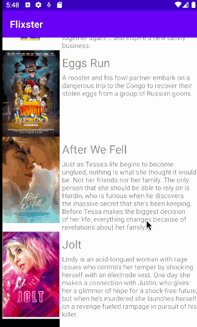
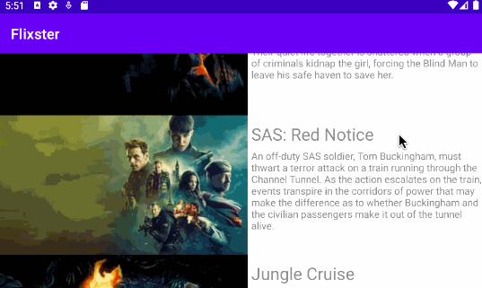

# Project 2 - *Flixster*

**Name of your app** is an android app that allows building a todo list and basic todo items management functionality including adding new items, editing and deleting an existing item.

Submitted by: **Remo Rulloda**

Time spent: **3** hours spent in total

## User Stories

The following **required** functionality is completed:

* [x] User can view a list of movies (title, poster image, and overview) currently playing in theaters from the Movie Database API.
* [x] Views should be responsive for both landscape/portrait mode. 
* [x] Display a nice default placeholder graphic for each image during loading
* [x] Improve the user interface through styling and coloring
* [x] For popular movies (i.e. a movie voted for more than 5 stars), the full backdrop image is displayed. Otherwise, a poster image, the movie title, and overview is listed. 

## Video Walkthrough

Here's a walkthrough of implemented user stories:

GIF created with [LiceCap](http://www.cockos.com/licecap/).

## Notes

Describe any challenges encountered while building the app.

## License

    Copyright [2021] [Remo Rulloda]

    Licensed under the Apache License, Version 2.0 (the "License");
    you may not use this file except in compliance with the License.
    You may obtain a copy of the License at

        http://www.apache.org/licenses/LICENSE-2.0

    Unless required by applicable law or agreed to in writing, software
    distributed under the License is distributed on an "AS IS" BASIS,
    WITHOUT WARRANTIES OR CONDITIONS OF ANY KIND, either express or implied.
    See the License for the specific language governing permissions and
    limitations under the License.
